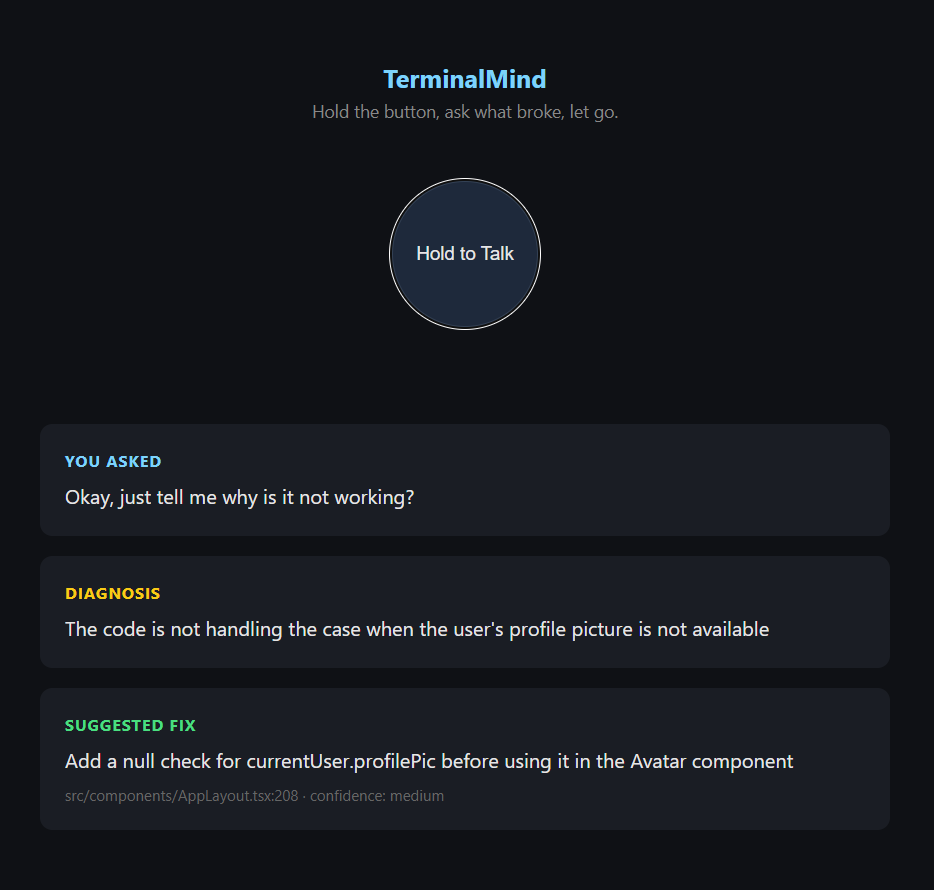
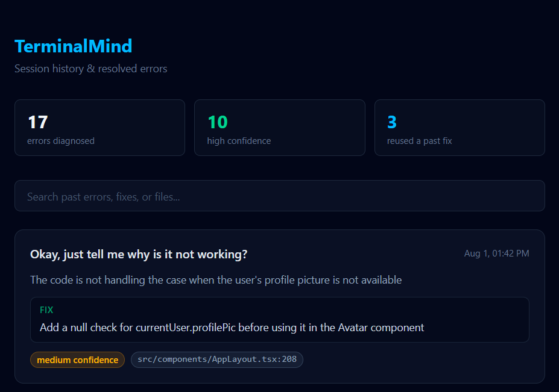

# TerminalMind

A voice-narrated debugging copilot that watches your terminal, correlates errors with your git diff, and tells you out loud or in a dashboard what broke and how to fix it. Grounded in your actual code, not generic Stack Overflow advice.

```
you: "why is this not working?"
termmind: "currentUser is accessed before AuthContext finishes loading.
           Add optional chaining: currentUser?.name || 'Loading...'
           → src/context/AuthContext.tsx:19 (confidence: high)"
```

## Why this exists

Debugging usually means: error appears → stop typing → alt-tab to a browser → search the error message → skim three tangentially-related Stack Overflow answers → alt-tab back → apply a guess. TerminalMind collapses that into: ask a question, get an answer grounded in the actual file and line that's broken, without leaving the terminal.

## What it actually does

- **Watches your terminal** in real time and keeps a rolling log of recent output
- **Correlates errors with your git diff** — the diagnosis isn't generic, it's "here's what changed in your last commit that likely caused this"
- **Answers by voice or text** — hold a button, ask out loud, get a spoken answer back, or just type `termmind ask "..."`
- **Remembers what it's fixed before** — asks a question similar to one you resolved last week? It surfaces that old fix as grounding context
- **Has a dashboard** — every diagnosis ever made for a project, searchable, with stats

## Demo

**Voice UI** — hold to talk, get a diagnosis, hear it spoken back:



**Dashboard** — every diagnosis ever made for a project, searchable:



## Architecture

```
┌─────────────────────────────────────────────────────────────┐
│  TAB 1: termmind record "npm run dev"                        │
│  → runs your dev command normally, mirrors output to          │
│    .termmind/session.log (rolling context buffer)             │
└───────────────────────┬────────────────────────────────────┘
                         │
┌─────────────────────────────────────────────────────────────┐
│  TAB 2: termmind ask "..."   OR   termmind serve (voice+web)  │
│                                                                │
│  contextAssembler ──► reads log tail + git diff + changed     │
│                        files                                  │
│  similarity      ──► TF-IDF search over .termmind/history.json│
│                        for similar past resolved errors       │
│  grokClient      ──► sends context + past fixes to Groq,       │
│                        forces structured JSON diagnosis back   │
│  whisperClient   ──► (voice path only) transcribes mic audio   │
│                        via Groq's hosted Whisper                │
└───────────────────────┬────────────────────────────────────┘
                         │
              .termmind/history.json (every diagnosis, ever)
                         │
┌─────────────────────────────────────────────────────────────┐
│  dashboard/ (React + Tailwind, served at /dashboard)           │
│  → fetches /api/history, renders searchable session timeline   │
└─────────────────────────────────────────────────────────────┘
```

## Tech stack

| Layer | Choice |
|---|---|
| CLI / backend | Node.js, TypeScript, Commander, Express |
| LLM | Groq (Llama 3.3 70B) — free tier, no credit card |
| Speech-to-text | Groq's hosted Whisper (large-v3-turbo) |
| Text-to-speech | Browser-native `speechSynthesis` |
| Similarity search | Hand-rolled TF-IDF cosine similarity, zero dependencies |
| Dashboard | React 19, TypeScript, Tailwind CSS v4, Vite |
| Git integration | `simple-git` |

## Setup

```bash
git clone https://github.com/LaibaBatoool/Termmind.git
cd termmind
npm install
cp .env.example .env
```

Add a free Groq API key (no credit card) from https://console.groq.com/keys to `.env`:
```
GROQ_API_KEY=your_key_here
```

Build:
```bash
npm run build
npm link          # makes `termmind` available globally on your machine
```

Optional — build the dashboard too:
```bash
cd dashboard
npm install
npm run build
```

## Usage

Run these from inside whichever project you want to debug — not from inside `termmind` itself.

**Terminal A — record your dev server / test runner:**
```bash
termmind record "npm run dev"
```

**Terminal B — ask about errors, by text or voice:**
```bash
termmind ask "why did this break?"
```
or
```bash
termmind serve
```
which opens a hold-to-talk voice UI at `localhost:4756`, and the dashboard at `localhost:4756/dashboard`.

**Anytime:**
```bash
termmind history     # text list of past diagnoses
termmind debug        # verify which API key is actually loaded
```

## Design decisions (and why they're not what the original spec said)

This project started from a spec that called for `node-pty`, local `whisper.cpp`, a global hotkey listener, and MongoDB Atlas Vector Search. Several of those were deliberately swapped out during development, for reasons worth explaining rather than hiding:

**`child_process.spawn` instead of `node-pty` for terminal capture.** A real PTY wrapper handles interactive prompts and ANSI colors more faithfully, but requires native compilation (`node-gyp`, Visual Studio Build Tools on Windows) for a first version that didn't need it. Plain spawn piping to a log file captures the same stdout/stderr data with far less setup risk. `record` is the only file that would need to change to upgrade this later.

**Browser `MediaRecorder` + hosted Whisper instead of a global hotkey + local `whisper.cpp`.** True OS-level hotkeys and raw mic capture in Node both need native modules. A local web page sidesteps this entirely — the browser handles mic permissions and audio capture natively, and Groq (the same account already in use for diagnosis) also hosts Whisper for free, so there's no local model download or native binary either.

**Hand-rolled TF-IDF instead of MongoDB Atlas Vector Search.** Real embeddings would be more semantically precise, but MongoDB Atlas means a third external account. The first attempt at local embeddings (`@xenova/transformers`) was rejected after `npm audit` surfaced a **critical unpatched vulnerability** in a transitive dependency (`protobufjs`) — a real finding, not a hypothetical one. For a personal history file that stays in the hundreds of entries, brute-force TF-IDF cosine similarity is simpler, has zero dependencies, and is accurate enough — error messages and stack traces are keyword-dense, which is exactly what TF-IDF is good at.

**Why the LLM is forced to return structured JSON.** So the CLI, voice UI, and dashboard can all reliably render `relevantFile`/`relevantLine`/`confidence` instead of regex-scraping free text — one contract, three consumers.

**Why the rolling context window discards old lines instead of sending everything.** Cost, latency, and token limits. `contextAssembler.ts` keeps only the last `CONTEXT_LINES` (default 200) of terminal output — a deliberate lossy-compression tradeoff, not an oversight.

## Project structure

```
termmind/
├── src/
│   ├── cli.ts              # entry point — record/ask/history/debug/serve
│   ├── config.ts           # .env loading, .termmind/ path resolution
│   ├── contextAssembler.ts # rolling log tail + git diff
│   ├── similarity.ts       # TF-IDF cosine similarity (RAG retrieval)
│   ├── historyStore.ts     # load/append .termmind/history.json
│   ├── grokClient.ts       # Groq chat completion + structured diagnosis
│   ├── whisperClient.ts    # Groq hosted Whisper transcription
│   ├── server.ts           # Express server (voice UI + dashboard + API)
│   └── types.ts
├── public/
│   └── index.html          # hold-to-talk voice UI (plain HTML/JS)
├── dashboard/               # React + Tailwind session history dashboard
│   └── src/App.tsx
└── .env.example
```

## What's next

- Real embeddings (with a vetted, non-vulnerable library) if TF-IDF's keyword matching starts missing semantically-similar-but-differently-worded errors
- `node-pty` for `record` if interactive prompts/colors ever need to survive the log faithfully
- Local TTS (Piper) as an upgrade path from browser `speechSynthesis`, if voice quality matters for a live demo


